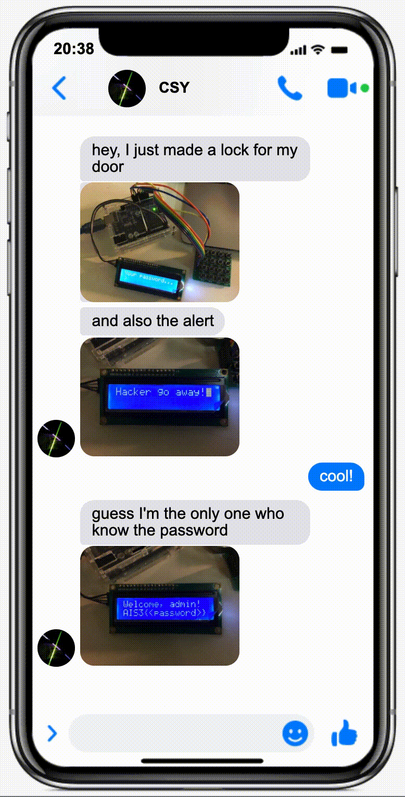
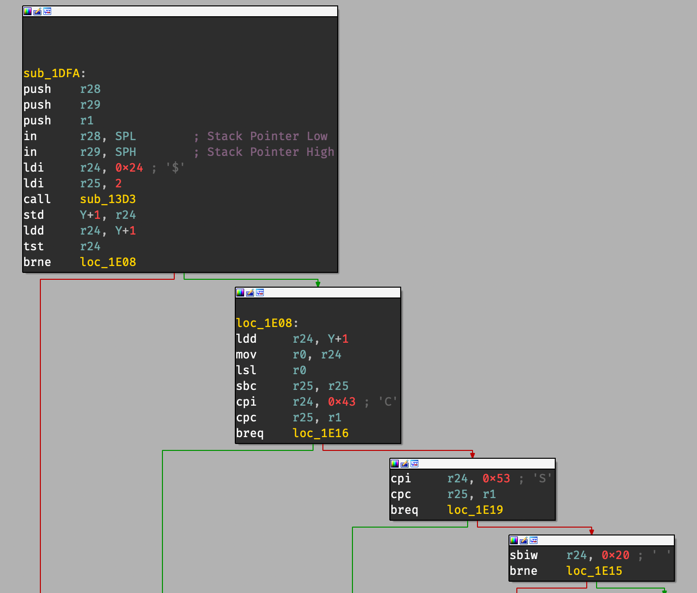
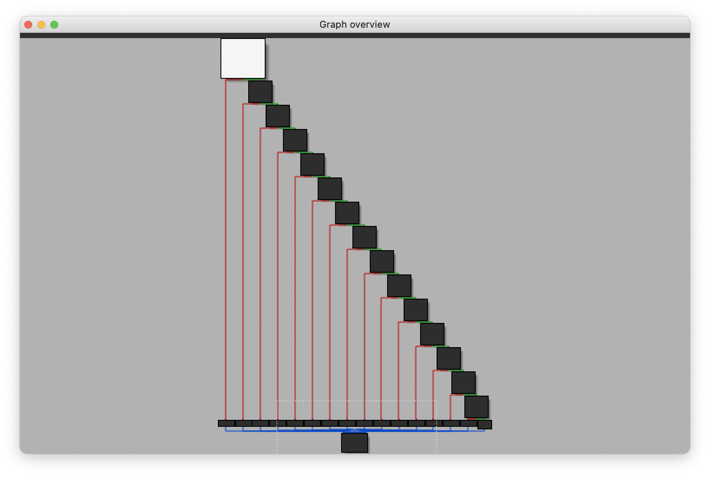
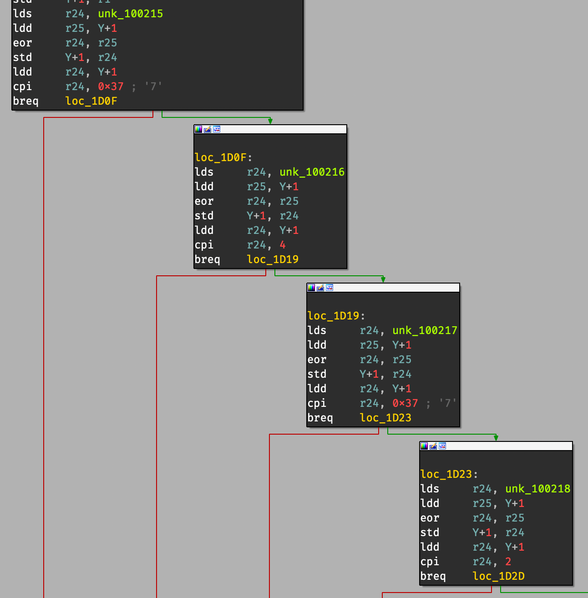

# [Reverse] The Secret Lock

- Points: 500
- Difficulty: ★★★
- Solves: 1/327 (Pre-exam)
- Keywords: Arduino, AVR

## Descriptions



Urrr... That's so annoying...

Luckily, I've already dump the firmware and the button mapping.

Guess he might not be the only person who knows the password soon!

This task is compiled with `-O0` flag, enjoy it!

Author: CSY54


**Hint 1**

1. The board is Arduino Uno.
2. The buttons are configured to use the ASCII value of the character written on the picture.
3. If you're using any decompiler like IDA, you might want to find out the value such as RAM, ROM size, loading offset... to make IDA work. It's all in the datasheet!
4. To decompile without IDA, try to figure out how it's compiled and what tools did it use to compile it. `objdump` is in the toolchain!

**Hint 2**

Since I thought this should not be a 500-point task. Here are some more hints...

1. The chip is ATmega328P, it's an 8-bit AVR Microcontroller with 32K Bytes In-System
Programmable Flash. You can buy one [here](https://store.arduino.cc/usa/arduino-uno-rev3).
2. Finding out the value to those configuration? Bruh, nobody want to do that themselves.

If you did load the firmware into any decompiler, you might agree with me that this is not a 500-point task.

## Writeup

從圖片可以知道該開發板是 Arduino Uno，而根據 [官網](https://store.arduino.cc/usa/arduino-uno-rev3) 可以知道他使用的是型號為 ATmega328P 的微處理器。

> Arduino Uno is a microcontroller board based on the **ATmega328P** ([datasheet](http://ww1.microchip.com/downloads/en/DeviceDoc/Atmel-7810-Automotive-Microcontrollers-ATmega328P_Datasheet.pdf)).

從 datasheet 中可以進一步得知該微處理器使用的是 AVR 指令集。

> 8-bit **AVR** Microcontroller with 32K Bytes In-System Programmable Flash


**`avr-objdump` 解**

搜尋 `arduino hex decompile` 等關鍵字可以找到找到 `avr-objdump` 這個工具，其用法就跟 `objdump` 差不多。Dump 完就可以 trace code 了，不過這裡 trace 起來會很麻煩，所以直接跳到 **IDA 解**吧。

```shell
$ avr-objdump -D -m avr task.hex

task.hex:     file format ihex


Disassembly of section .sec1:

00000000 <.sec1>:
       0:	0c 94 62 00 	jmp	0xc4	;  0xc4
       4:	0c 94 8a 00 	jmp	0x114	;  0x114
       8:	0c 94 8a 00 	jmp	0x114	;  0x114
       ...
```


**IDA 解**

若要讓 IDA 成功載入 [task.hex](release/task.hex)，需要在載入檔案時將 processor type 設為 Atmel AVR，並於裝置型號選擇 ATmega328P（對應的 cfg 檔可以在 [SilverBut/avr_helper](https://github.com/SilverBut/avr_helper) 找到），如此即可讓 IDA 成功載入 [task.hex](release/task.hex)。Functions window 也會跳出幾個重要的 function，像是：`__RESET`、`SPM_READY`、`TWI`、`TIMER0_OVF`...等（關於這些 function 的用途可以在 datasheet 中找到）。

如同其他 reverse 的題目，載入後需要找進入點，一個最容易想到的進入點無非是 reset（`j___RESET` or `__RESET`），因為當你按下 Arduino 上的 reset button 時，他會從 0 開始執行，而 0 的位置恰好就是 `j___RESET` 的位置（我這麼說怪怪的，比較好的說法可以在 [這裡](https://www.avrfreaks.net/forum/entry-point) 找到）。

進入點找到後就可以開始追下去了。追幾個 function 後可以找到 `sub_1DFA`（`j___RESET` → `__RESET` → `sub_1E7F` → `sub_1DFA`），他的行為看起來是按下按鈕後判斷是哪個按鍵並執行對應的行為，並且比較的值 `C` 與 `S` 恰好就是 Clear 與 Submit 兩個按鍵。



既然是要按下 Submit 才會開始判斷輸入是否正確，可以追進當比較為 `S` 成立時會呼叫的 function `sub_1CFF`。整個 `sub_1CFF` 有一堆的比較，並且只有全部都成立才會回傳 1，而前一個 function `sub_1DFA` 也是根據回傳的結果去做不同的事，其行為與輸入的正確與否會導致顯示訊息的不同一致。



閱讀一下這段 AVR 的 code 可以知道 `sub_1CFF` 在做的事就是將一段連續記憶體的前 `i` 個值 xor 起來並跟一些數字比較，即 `xor(input[0..i]) == some value`，透過這些數值即可反推原陣列內容，而 flag 就是 `AIS3{<password>}`



